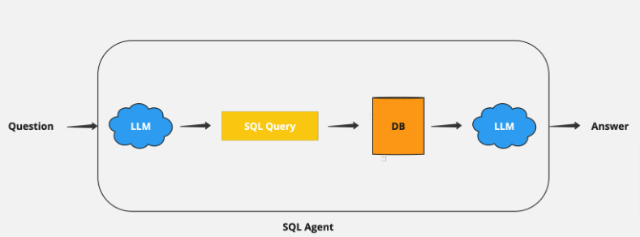

# Objective
---
Create an LLM system that can query private structured data (SQL database). Create a helpful agent for our non-technical analysts to query an SQL database without needing SQL knowledge.

An LLM-powered Q&A agent that understands plain English questions, converts them into SQL queries, retrieves the data, and presents the results in plain English. Build a command-line agent where users can type in questions and get answers from an SQL database.

## High-level
- Convert question to DSL query: Model converts user input to a SQL query.
- Execute SQL query: Execute the query.
- Answer the question: Model responds to user input using the query results.

## Hints/Recommendations

To incorporate reasoning and interaction capabilities in the agent, we can use ReAct prompting. 

Here's a concise guide on how to integrate ReAct logic using Langchain, a powerful tool for building such agents.

1. ReAct Prompting

ReAct (Reasoning and Acting) prompting enables the agent to think step-by-step, reason through problems, and interact with external tools (like databases). This helps in building more intelligent and interactive agents. Learn more

Here is an example of how to build ReAct logic to an agent using [Langchain](https://python.langchain.com/v0.1/docs/modules/agents/agent_types/react/).

2. Groq/Langchain

Langchain already provides nice integration with Groq. All you need is your API key.