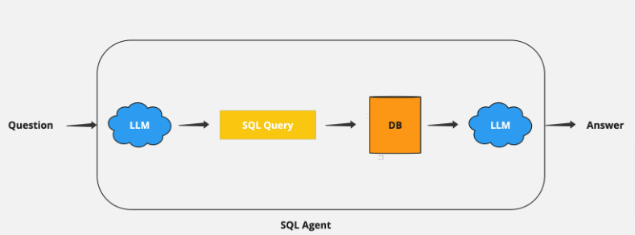

# AI SQL Agent
---
A SQL AI agent that can query private structured data (SQL)

## Objective
Create an LLM system that can query private structured data (SQL database). Create a helpful agent for our non-technical analysts to query an SQL database without needing SQL knowledge.

An LLM-powered Q&A agent that understands plain English questions, converts them into SQL queries, retrieves the data, and presents the results in plain English. Build a command-line agent where users can type in questions and get answers from an SQL database.



### High-level
- Convert question to DSL query: Model converts user input to a SQL query.
- Execute SQL query: Execute the query.
- Answer the question: Model responds to user input using the query results.

### Tech Stack
- GrogCloud
- Llama3
- Langchain

<!-- ## Setup Instructions -->
<!-- 
# REMEMBER TO COMPLETE THE INSTRUCTIONS BELOW!
- add how to use docker
- add how to upload data
- add test_sqlite.py to test db connection -->

<!-- # Learn Python and SQL
- add steps -->
<!-- 
# Finetune Llama3 (OPTIONAL)
__NOTE! The Llama3 used was NOT fine tuned___
- __Reference video:__ https://www.youtube.com/watch?v=pK8u4QfdLx0&list=PLZi_z2W1127yNRvnVNYSLnW_TqotsO8Xp&index=1&t=143s
- Why?
  - Cost-effectiveness: Leverages the power of pre-trained LLMs without full retraining, saving significant time and resources.
  - Improved performance: Enhances the LLMs performance and accuracy on tasks relevant to your accuracy on tasks relevant to your application.
  - data efficiency: Achieve excellent results even with smaller, targeted datasets.
  - Subject specific: Creates data specific to your use case.
- How
  - Data preparation: Curating a smaller, high-quality dataset tailored to your specific use case and labelling it appropriately. NOTE: This can take a long time. Hours, days, even weeks or months. Depends on your use case.
  - The pre-trained LLMs weights are updated incrementally using optimization algorithms like gradient descent, based on the new dataset.
  - Monitoring and refinement: Evaluating the model's performance on a validation set helps prevent overfitting and guide adjustments. 
  - __Links:__
    - __David Ondrej Colab:__ https://colab.research.google.com/drive/1efOx_rwZeF3i0YsirhM1xhYLtGNX6Fv3?usp=sharing
    - __unsloth repo:__ https://github.com/unslothai/unsloth?tab=readme-ov-file
    - __Dataset Example:__ https://huggingface.co/datasets/yahma/alpaca-cleaned -->


__GROQ__
- Create an account on [GroqCloud](https://console.groq.com/login)
- Generate an API key [here](https://console.groq.com/keys)
- [Quickstart](https://console.groq.com/docs/quickstart) guide to install necessary dependencies.

__Setup SQLite__
- We will use an SQLite database for this project, but feel free to use any database you prefer.
- Download and install SQLite from the official SQLlite [website](https://sqlite.org/download.html)
- Download Microsoft Northwind Sample Database. You can download it from [here](https://github.com/jpwhite3/northwind-SQLite3)
- Populate Your SQLite Database with Northwind Data.
- Verify the data by running a simple query: 'SELECT name FROM sqlite_master WHERE type='table';

<!-- 
__Required Libraries__
 -  -->

 __Running The App__
 
```shell
python sql_chain.py
```

## Hints/Recommendations

To incorporate reasoning and interaction capabilities in the agent, we can use ReAct prompting. 

Here's a concise guide on how to integrate ReAct logic using Langchain, a powerful tool for building such agents.

1. ReAct Prompting

ReAct (Reasoning and Acting) prompting enables the agent to think step-by-step, reason through problems, and interact with external tools (like databases). This helps in building more intelligent and interactive agents. Learn more

Here is an example of how to build ReAct logic to an agent using [Langchain](https://python.langchain.com/v0.1/docs/modules/agents/agent_types/react/).

2. Groq/Langchain

Langchain already provides nice integration with Groq. All you need is your API key.